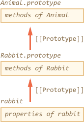

### js之工厂构造函数模式

### 类模式

### 前言

在面向(oriented)对象编程中,一个类是一个可扩展的程序代码的模板，用于创建对象，为状态（成员变量）和行为实现(implementations)（成员函数或方法）提供初始值

JavaScript中有一个特殊的语法结构和关键字类。但在学习之前，我们应该考虑“类”这个术语来自于面向对象编程的理论。定义在上面引用，它是语言无关独立的

在JavaScript中有几个众所周知的编程模式，即使不使用class关键字也可以编写类。在这里，我们首先来谈谈他们

这个类的构造将在下一章中描述，但是在JavaScript中它是一个“语法糖”，是我们在这里学习的一种模式的扩展

### 功能类模式

根据定义,下面的构造器函数可以被认为是“类

```
   /*
   *
   *  用new关键字+函数名(),那么这个函数为构造器函数
   *  @construtor: User
   *  @methods:sayHi
   *
   *
    */
   functoin User(name){
     this.sayHi = function(){
         alert(name);
     }
   }
   let user = new User("john");
   user.sayHi();  // john
```
结果如下所示:


它遵循定义的所有部分

1. 它是一个用于创建对象的“程序代码模板”（可以用new来调用）
2. 它提供了状态的初始值（参数名称）
3. 它提供了方法（sayHi）

这被称为功能类模式

在函数类模式中，用户内部的局部变量和嵌套函数，没有分配给它，从内部可见，但外部代码无法访问

所以我们可以很容易地添加内部函数和变量,比如calcAge()

```
/*
*  添加内部函数和变量
*  @constructor: User
*  @parameter: 参数name,birthday
*  @function calcAge
*  @methods: sayHi
*  @return 时间戳
*
 */
function User(name,birthday){
    // only visible from other methods inside User
    function calcAge(){
        return new Date().getFullYear()-birthday.getFullYear();
    }
    this.sayHi = function(){
        alert(`${name,age:${calcAge()}}`);
    }
}
let user = new User("john",new Date(2000,0,1));
user.sayHi();  // john,age:17
```
结果如下所示:


在这个代码中,变量名,生日和函数calcAge()是内部,对象是私有的。他们只能从里面看到

另一方面，说Hi就是外在的，公开的方法。创建用户的外部代码可以访问它

这样我们就可以从外部代码中隐藏内部实现(internal implementation)细节和辅助方法。只有分配给这个构造函数才可以看得见外面的

### 工厂类模式

我们可以创建一个班级,而不使用新的

像这样

```
/*
* 工厂类模式
* @constructor User
* @parameter 形式参数:name,birthday
* @function calcAge
* @return 当前的年份-出生的年份
* @return User函数返回一个sayHi函数,将名字和年龄结果进行输出
*
*
 */
function User(name,birthday){
    // only visible from other methods inside User
    function calcAge(){
        return new Date().getFullYear()-birthday.getFullYear();
    }
    return{
        sayHi(){
            alert(`${name},age:${calcAge()}`);
        }
    }
}
let user = User("john",new Date(2000,0,1)); // 函数名的调用,函数表达式赋值
user.sayHi();  

```
实现的效果如下所示


正如我们所看到的，函数User返回一个具有公共属性和方法的对象。这种方法的唯一好处是我们可以省略new：write let user = User（...）而不是let user = new User（...）。在其他方面，它几乎与功能模式相同

### 基于原型的类

基于原型的课程是最重要的,也是最好的。功能和工厂类模式在实践中很少使用

不久你就会明白为什么

这是用原型重写的同一个类

```
/*
*
* 基于原型重写的一个类
* @function User
* @parameter name,birthday
* @prototype 
* @methods: _calcAge,sayHi
* 
*
 */
function User(name,birthday){
    this._name = name;
    this._birthday = birthday;
}

User.prototype._calcAge = function(){
    return new Date().getFullYear()-this._birthday.getFullYear();
}

User.prototype._calcAge = function(){
    return new Date().getFullYear()-this_birthday.getFullYear();
}

User.prototype.sayHi = function(){
    alert(`${this._name},age:${this._calcAge()}`);
}

let user = new User("john",new Date(2000,0,1));
user.sayHi();

```
实现效果如下所示:

代码结构

1. 构造函数User仅初始化当前的对象状态
2. 方法被添加到User.prototype中

正如我们所看到的,方法在词法作用域上不在函数User内部,它们并不共享一个通用的作用域环境.如果我们在函数User中声明变量,那么它们将不会被方法看到

所以，有一个众所周知的协议，内部属性和方法前缀为下划线“_”。像_name或_calcAge（）。从技术上讲，这只是一个协议，外部代码仍然可以访问它们。但大多数开发人员认识到“_”的含义，并尽量不要触摸外部代码中的前缀属性和方法

以下是功能模式的优点:

1. 在功能模式中，每个对象都有自己的每个方法的副本。我们在构造函数中分配了this.sayHi = function(){...}和其他方法的单独副本

2. 在原型模式中，所有的方法都是在所有用户对象之间共享的User.prototype中。一个对象本身只存储数据

所以原型模式更具有记忆效率

但不仅如此。原型允许我们以非常有效的方式设置继承。内置的JavaScript对象都使用原型。还有一个特殊的语法结构：“类”，为他们提供漂亮的语法。还有更多，所以让我们继续他们

### 类基于原型的继承

假设我们有两个基于原型的类

兔子:
```
/*
*
* 类基于原型的继承
* 
* @function Rabbit
* @paraterm name  
* @method jump
* @constructor: Rabbit
* 
*/
   function Rabbit(name){
      this.name = name;
   }
   Rabbit.prototype.jump = function(){
      alert(`${this.name}jimp!`);
   }
   let rabbit = new Rabbit("my rabit");
   rabbit.jump();  // my rabit jimp

```
实现的效果图如下


和动物

```
   /*
   *  @constructor:Animal
   *  @methods:eat
   *
   *    
    */
   function Animal(name){
       this.name = name;
   }
   Animal.prototype.eat = function(){
       alert(`${this.name}eats`);
   }
   let animal = new Animal("My animal");
   animal.eat();
```
代码实例效果如下:


现在他们完全独立了

但是我们希望兔子能扩展动物。换句话说，兔子应该以动物为基础，可以使用动物的方法，并用自己的方法扩展它们

原型语言是什么意思？

现在兔子对象的方法在Rabbit.prototype中。如果在Rabbit.prototype中找不到方法,我们希望兔子使用Animal.prototype作为“后备”

所以原型链应该是Rabbit→Rabbit.prototype→Animal.prototype。

像这样


要实现的代码
```
   /*
   * @constructor Animal,Rabbit
   * @paraterm name
   * @methods:eat,jump
   * 
   *
   *
    */
   // same Animal as before
   function Animal(name){
      this.name = name;
   }
   // All animals can eat,right?
   Animal.prototype.eat = function(){
      alert(`${this.name}eats`);
   }
   // same Rabbit as before
   function Rabbit(name){
      this.name = name;
   }
   Rabbit.prototype.jump = function(){
      alert(`${this.name}jumps`);
   }
   // setup the inheritance chain
   Rabbit.prototype._proto_= Animal.prototype; // (*)

   let rabbit = new Rabbit("white Rabbit");

   rabbit.eat();  // rabbits can eat too
   rabbit.jump();  
```

该行（*）设置了原型链。所以兔子首先在Rabbit.prototype中搜索方法，然后是Animal.prototype。然后，为了完整起见，如果在Animal.prototype中没有找到该方法,则继续在Object.prototype中进行搜索,因为Animal.prototype是一个普通的普通对象,所以它继承了它

所以这是完整的画面


###小结

术语“类”来自面向对象编程。在JavaScript中，它通常意味着功能类模式或原型模式。原型模式更强大，更高效，所以它建议坚持下去

根据原型模式

1. 方法存储在Class.prototype中
2. 原型相互继承


