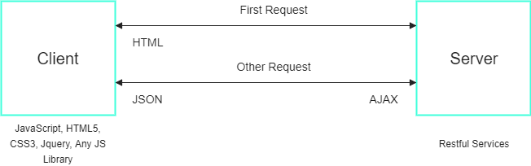

### 现代Web开发方法

>### 几个提示脱颖而出的现代网络发展

在本文中，我将介绍使用基于单页JavaScript的框架的基本概念，优点和缺点

首先，单页面应用程序是什么？

让我们看看传统的Web应用程序是如何工作的,通常，一个完整的堆栈服务器端应用程序在服务器本身上生成Web应用程序的所有数据。只有这样才能在页面呈现之前将其发送给客户端


单页应用程序概述（SPA）

内容从数据库中获取，然后通过控制器传递，最后在视图模板发送前与视图模板合并

这体现在每次浏览应用程序或网站时重新加载的页面的形式。 JavaScript在这里的作用是非常小的。它只负责控制用户界面的小部分

几年前，单页应用程序开始在开发人员中流行起来。单个页面应用程序向服务器发送一个HTML文件框架的请求，以及样式和脚本

与此同时，以Ajax请求的形式向服务器发出后续请求。 HTML页面内容本身使用JavaScript呈现，并使用CSS进行样式化。

好处是我们只取得我们需要的内容的一部分，而不是整个页面，这提供了更少的服务器负载和更快的用户界面。

以下是最流行的基于JavaScript的单页面应用程序（SPA）框架

* Angular.js - 连接到静态HTML的客户端库，具有一组用于数据绑定的属性
* ReactJS - 用于构建Web应用程序的基于组件的客户端库
* Vue.js - 提供双向数据绑定（也可以在AngularJS中看到）和服务器端渲染，如Angular 2和ReactJS
* Ember.js - 客户端库使用Handlebars模板引擎来构建Web应用程序
* Meteor.js - 由NodeJS和MongoDB支持的全栈框架。其中使用Blaze，Angular和React进行模板化


2017年5个最佳JavaScript框架

单页应用程序在内容，逻辑控制器和演示文稿之间创建了界限。对于MVC框架来说，它是一个关注点的分离

* 内容 - 通常使用REST以JSON格式提供

* 逻辑控制器 - 负责处理请求并将数据发送回应用程序。通过使用HTTP和WebSockets处理

* 演示文稿 - 由包含模板标签的HTML模板进行控制，以执行诸如迭代数据集之类的任务

### 一个服务器端的例子

这个例子展示了我们如何获取和渲染不同级别的用户列表

让我们从获取用户的服务器端控制器开始，以JSON格式返回一个列表

```
/**
 *  Users controller (NodeJS)
 */
const app = express(),
  
/**
 *  This function fetches staff users
 *  from the MongoDB collection
 */
const fetchUsers = (offset = 0, limit = 10) => {
  return new Promise((resolve, reject) => {
    Users.find({}, {
      $offset: offset,
      $limit: limit
    }).then((result) => {
      if(error) {
        reject(error);
      }
      else {
        resolve(result);
      }
    });
  });
};

/**
 *  This function returns a list
 *  of users in JSON format.
 */
app.get('/staff/users', (request, response) => {
  fetchUsers()
  .then((result) => {
    response.status(200).json(result);
  })
  .catch((error) => {
    response.status(500).json(error);
  });   
});

```
如果我们请求服务器从https：// yourserver / staff / users获取一些用户，则回应如下:
```
[
  {
    "name":"Savinda",
    "location":"Colombo"
  },
  {
    "name":"Thameera",
    "location":"Colombo"
  },
  { "name":"Andy",
    "location":"California"
  },
  { "name":"Ian",
    "location":"New York"
  }
]
```
### 客户端控制器

如果我们使用客户端控制器，代码将如下所示：
```
Template.users = {
  /**
   *    Array to store list of users.
   */
  users: [],

  /**
   *    This event  fires when a template is ready.
   */
  ready: () => {
    fetchUsers();
  },

  /**
   *    Make AJAX request to fetch list of users.
   */
  fetchUsers: () => {
    let request = new XMLHttpRequest(),
      url   = 'https://yourserver/staff/users'

    /**
     *  We make the request...
     */
    request.open('GET', url, true);

    /**
     *  When the request has completed...
     */
    request.onload = () => {
      /**
       *    Check the response status code
          to make sure everything working fine...
       */
      if(request.status === 200) {
        /**
         *  Assign the response to the list of users.
         */
        this.users = JSON.parse(request.responseText);
      }
    };
  }
};

```
我们可以使用以下代码从列表中呈现用户
```
<template name="user">
  <li>
    {{ name }} is in {{ location }}.
  </li>
</template>
```
查看模板的mvc应用程序，使用户看起来像这样：
```
<html>
  <head>
    <title>
      Single Page Application | Users
    </title>
  </head>
  <body>
    <ul class="list-of-users">
      {{ each users }}
        {{> user }}
      {{ end }}
    </ul>
  </body>
</html>
```
浏览器最初呈现模板时，会调用控制器以获取用户的模板。当用户被抓取时，它们会自动呈现给列表

### 一些重要的概念

这些是一些概念，如果你是初学JavaScript的客户端开发

* 控制器 - 负责管理数据和附加的视图文件。还包含处理应用的UI行为的功能
* 模板 - 包含特殊标签以呈现内容的HTML文件
* 视图 - 与使用和功能中的模板类似。但是，视图是将整个页面放在一起的不同组件的总体集合
* 绑定 - 处理该视图的控制器内的数据更改时，自动更新的视图的渲染内容
* 路由 - 在浏览应用程序时，这使用HTML5 pushState深度链接不同的视图
* Ajax请求 - 将请求发送到服务器以便在不重新加载页面的情况下获取数据。如果没有Ajax，将不会有单个页面的应用程序
* Web套接字 - 用于在Web浏览器和服务器之间建立持久连接的API。 HTTP协议请求数据，然后断开连接

### 总结

整篇主要是从传统的web应用过度到现代的web应用,也就是现在流行的单页面应用开发,其实单页面应用本质上也就是Ajax的应用,不就是改变传统的客户端与服务端的频繁的数据交互模式,避免响应慢,页面闪烁空白,整个页面刷新等诟病嘛,提高用户体验减少服务器端的压力嘛,将视图层(view),控制层(control),数据层(model)进行分离,将一些页面逻辑控制从服务器端给抽离出来让前端来处理,比如路由等,服务端只提供能识别前端http请求的数据,达到在不刷新整个页面的情况下,在用户执行某些DOM事件(比如点击,滚动)等时,页面的局部刷新呈递新数据的展现,至于更深的体会,还是要多撸代码,概念的东西说多了都是故事


